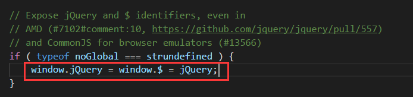

> 这篇文章只旨在记忆如何写jquery插件，最重要的还是插件的具体逻辑实现，这还是需要自己去思考的

- ``jQuery``插件的写法一般常用的方法有两种

> 第一种：``jQuery.extend()``或者``$.extend()``


由1.11.3源码可以看出``jQuery``和``$``的关系


其实``jQuery``和``$``就是一个东西（抽时间好好看看源码）

用这个方法可以向jQuery自身扩展方法，例如
```
//扩展了一个maxNum方法，可以直接用$.maxNum调用
$.extend({
    maxNum:function(x,y){
        if(x > y){
            return x;
        }else{
            return y;
        }
    }
});
var num = $.maxNum(3,4);//4
```
<!-- more -->
> 第二种：``jQuery.fn.extend()``或者``$.fn.extend()``
这种方法就是给jQuery的原型增加方法（源码 89行）
```
jQuery.fn = jQuery.prototype = {
    //各种方法
};
```
我们用这个方法主要给jQuery对象增加方法，调用方式为：``$(ele).method()``
```
$.fn.extend({
    findFirst:function(){
        return this.get(0);
    }
})

```


> 水平有限，写的错误的地方望指出


